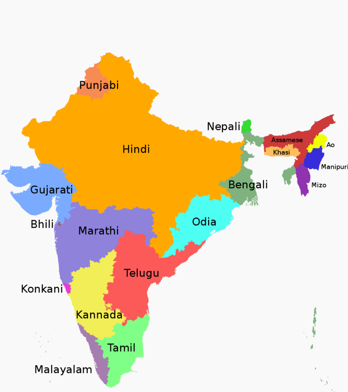

我们这周聊的话题有不少涉及到俄罗斯。对于这个国家，大家的看法其实分歧特别大，如果给它打一个分数，恐怕从不及格到90分都有。

打不及格的原因有很多，主要是它经济一直不景气，而且除了有资源，看不到什么亮点。打90分的，主要是因为它庞大的核力量，加上它似乎还算在政治上有影响力。这些人常常在想，俄罗斯只是现在虎落平阳，或许能再强大起来呢。
另一方面，说到印度，大部分中国人其实是看不起的，觉得又脏又乱又落后。虽然这些年它的经济发展不错，但是大家总是觉得它离中国的距离还远。其实，如果有一个国家能够打破中美目前实际上G2的格局，只有印度。因此，对于今天题目的问题，其实我的答案很清楚了。<escape><!-- more --></escape>

俄罗斯和印度其实是两个差别巨大，甚至能形成反差的国家，它们今天的发展之路其实代表了两种价值观。我们先来讲讲俄罗斯。

有些人觉得俄罗斯作为世界上土地面积最大的国家，应该很有潜力，只是最近虎落平阳罢了。其实，今天才是它历史上长期以来真实的状态，二战后那个表面上强大的帝国其实是一种幻象。

在历史上俄罗斯虽然幅员辽阔，但是可耕种的面积不多，而且多在今天的乌克兰，虽然在远东有很多资源，但是开采资源的成本极高，基本上只是维持收支平衡而已。今天俄罗斯真正便于发展的地区，就是它在欧洲东部靠近乌克兰和巴尔干，面积和中国的华东华北加起来差不多大。加上俄罗斯没有好的海港，它发展经济其实困难很大。

在历史上，人们对俄罗斯强大的理解有很多是误解，包括对它军事实力的理解。高晓松在一期节目中讲了这样一句话，“俄罗斯人好战不善战，越南人不好战但善战”，这个评价是中肯的。从大彼得开始，俄罗斯就一直在打仗，虽然地盘不断扩大，但是打的漂亮仗真不多。

有人说拿破仑战争它打赢了，它其实除了死了很多人，并没有得到什么，倒是英国人讨到了便宜。也有人说它二战打败了希特勒，如果看看它死了多少人就不会觉得它军事上有什么了不起，直到柏林之围的时候，它和德国的伤亡比才达到1:1，此前一直是以极高的伤亡比取胜的。

在今天一些教科书中，对美国在二战中给予苏联的巨大援助只字没有提。在二战中，美国给前苏联的援助是给国民政府援助的10倍左右，它的运输几乎完全仰仗美国提供的车辆（占了车辆的90%以上）。

根据1941年9月29日至10月1日在莫斯科举行的英美苏三国代表协议，美国每个月给前苏联提供400架飞机、1100辆坦克，以及近乎无限的军用物资。想想中国军队在八年抗战中这些重武器一共才有多少，就能体会当年罗斯福是多么“偏心”。可以讲在某种程度上，是美国出钱，前苏联出力在和德国死磕。当然，前苏联也很争气，把不可一世的希特勒打败了。

在二战后，虽然前苏联一度号称世界第二大经济体，但是那是以它自己定的卢布官价结算的。当时官价一卢布能换一个多美元，但是在市场上，连0.2美元都换不到。因此，俄罗斯经济其实并不曾辉煌过，今天大家看到的俄罗斯，其实是一个真实的俄罗斯。

从历史上到今天，俄罗斯真正的悲剧在于它从不在贸易的必经之路上，总是处在地缘政治的边缘，并且远离世界经济中心。欧洲从近代开始工业革命，俄罗斯由于和西欧距离太远，工业起步很晚，基础非常薄弱。

在二战后，它又没有被纳入全球贸易的圈子，以至于在信息时代晚期落伍了。你不曾听说过哪项计算机的发明是俄罗斯做出来的。由于没有贸易的传统，俄罗斯做的东西是“傻大笨粗”，白送给你，估计你今天都不要。不仅做的东西如此，今天它留下的地标建筑大多是一个多世纪前的，后来建造的因为是规划出来的，能用就行，今天你大多看不上眼。

地理位置的局限，又导致了人做事方法的缺陷。俄罗斯几乎从上到下都没有动力通过劳动改变自己的经济地位和社会环境。他们不喜欢前苏联，但是又不愿意融入新的世界。实际上，在世界上，只有在商业竞争环境下，制造工业品时才会精益求精，做出来的商品才会人性化，让大家喜爱。从这里面，你也能体会为什么市场经济很重要，自由贸易很重要。

未来的俄罗斯能否崛起，今天看不到任何迹象，因此我们多关注它一点，少关注它一点其实并没有太大关系。相比俄罗斯，印度则非常值得大家关注了。

几年前中国一位非常成功的投资人在考虑是否能将投资的重点放在印度，专门请我给他分析了印度的政治、经济和国民特点。我给他分析过后，他果断地大规模投资印度，今天是那里最大的投资人之一，投资回报非常好。

在那次谈话中，我给他讲了印度的五个特点，这促成了他大手笔在印度投资，这五点我也分享给你。

1.印度从某种程度上讲，不是一个统一的国家。它虽然有13亿人，和中国差不多，但是并没有统一的市场。

在历史上，印度并不是一个统一的国家，它是一个地区，一个地理名词，和赤道、拉美这样的概念没有什么区别。今天，印度各个邦虽然在行政级别上和中国的省相当，但是相当独立。

印度没有一个绝大多数人都能讲的语言，很多人觉得印度人都在讲印地语，其实它的使用者人数只有人口的40%左右，基本上是北方的人口，以新德里周围为代表。而东西海岸的名城孟买和加尔各答，都不说印地语。下图显示出印度讲各种语言的地区，每一种颜色都代表一种语言。

因此，在印度做生意，不同地区差异很大。此外，印度的宗教和种族矛盾也很深，国家的凝聚力不强。

2.印度的种姓制度还存在，而且比大家想象的要严重。

今天很多高种姓的女子年龄很大还难以结婚，因为她们是不能“下嫁”的。这一点就不多论述了。基于这个事实，我对我的朋友讲，你把印度看成是一个3亿人的国家就好了，因为社会底层的人其实消费能力很弱。

他对我讲，3亿人不少了，等于广东、江苏、浙江、山东、上海和北京的总和了，如果都能成为中产阶级，其实市场规模非常可观。需要指出的是，虽然印度人总体随遇而安，但是较高种姓的人还是很有进取心和责任心的。

很多人到印度做生意失败的原因，是把它想成了中国。如果一开始期望值不要太高，也就不会失望。

3.印度人远比我们想象的努力。我们中国人从小就不得不好好学习，功课负担很重，其实印度人从小的学习负担一点不比中国人轻。和中国非常相似的是，印度大学生学习理工的非常多，整个国家有很多很好的数理人才。

在工作中，印度人也很能吃苦，这让他们仿制很多东西能做得还不错。但是由于工业基础较差，又没有大批的高水平工匠，他们目前工业制造能力不强。因此，印度经济的增长主要是服务业的发展。由于工业品出口能力有限，它的经济驱动主要来自于内需。

印度人做事比较专一，他们改换职业的情况并不多。这是印度人在硅谷的跨国企业能够做得比较好的原因。

4.印度虽然作为一个国家，政府没有什么钱，政府大楼破破烂烂，办事效率也低下，但是它藏富于民，相比政府，民间的钱似乎更多一些。实际上印度政府在经济中的作用有限，它难以集中力量办大事。

但是我们不能把中国靠大政府来管理的做事方式硬套到印度头上。我们很多由政府主导的事情，在印度是由民间完成的。因此涉及到民生的地方改善得还是不错的，并非像人们想象的那么差。由于印度政府对经济的影响小，它也就不存在政治稳定还是不稳定的问题，反正政府没什么用。

5.虽然印度有诸多的问题，但大多数是慢慢能够解决的问题。美国大部分学者都认为印度GDP总量超过美国只是时间的问题。这除了它近年来的发展速度较快之外，还有一个原因是人口比较年轻，未来将会是一个劳动力大国。从历史上看，印度在很长的时间里GDP都是全球第二，仅仅在150年前才被英国超越。因此，它作为一个经济大国是有基础的。

此外，印度的地理位置要远比俄罗斯好，这也给它的发展带来了便利。

相比俄罗斯，印度最亮眼的地方就在于，在未来它是有希望的，而俄罗斯却让人很难看到希望。对于俄罗斯，西方学者一致的看法是，它的GDP在世界的占比将不断下降，其国家地位也将不断下降。人有时候不在于现在有多穷，而在于他有没有希望富裕起来。

在今天的世界上，其实各国是用经济总量和贸易总量在说话，不是用大炮在说话。因此，军事实力再强，如果不能变成保护其全球贸易的手段，就都是在浪费钱。因此，如果让我来选择在哪里投资，我会选择印度而不是俄罗斯。

当然，我的看法也是一家之言。如果你对这两个国家有更深入的了解，不妨分享给大家。