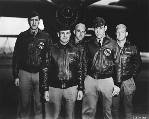

今天我们的话题比较奇怪：强者怎么能获得胜利？强者注定胜利啊，他还用操心这个问题吗？

就像《孙子兵法》里说的：五则攻之，十则围之。意思是如果你的兵力是对手的五倍，那就别使什么计谋了，老老实实进攻吧。如果你的兵力是对手的十倍，那连打都不用打，就把它围起来，等他自己溃散就好。

但是事情恐怕没有这么简单。强者一定能赢，这是站在弱者的角度来看问题，只看到了输赢。而站在强者的角度看呢？他的首要目标可就不是赢了，而是用最小的代价就能赢，从而能长期保持优势。长期保持优势，才是强者真正想做到的事情。换句话说，强者的力量，不是用来打的。强者是要追求另外一个目标，就是不打，但是因为我有力量，你不敢跟我打。确保强者的地位。

如何用现有的力量，形成威慑效应，这才是强者的真正难题。这可比简单的打得赢，要难得多。
带着这个视角，我们再来看看第二次世界大战中美国和日本之间的太平洋战争，我们对美国的很多策略，就会有更深一步的理解。

在太平洋战争里，强者是美国，弱者是日本。

1941年12月7日，日军偷袭珍珠港成功，但是要知道，就在1941年，美国的GDP大概是2000多亿美元。而日本的GDP勉强能到200亿美元，这是个10倍的差距。

那美国应该按照《孙子兵法》说的，按部就班地进攻吗？反正最后也一定是能够获得碾压性的胜利？

不是，在太平洋战争中，美国做了几次非常反常的冒险。

比如，在珍珠港被偷袭之后，美军第一个有组织的军事行动，叫做“杜立特轰炸东京”。一位叫杜立特中校带领16架轰炸机轰炸了东京。这次行动，事后看起来非常得不偿失。

左二为杜立特中校

美国要轰炸东京，是要飞过半个太平洋。当时根本没有任何一种飞机能做到。那怎么办？

两个办法。首先要让飞机冒险。为了给飞机减轻重量飞得更远，美军干脆把B-25轰炸机尾部的炮塔给拆了。把两挺用来自卫的机枪换成了，两根木棍，说白了就是假枪。万一日本战斗机来了，只能吓唬人。可以说，这是把飞行员的命赌上了。

其次，赌上了两艘航母。为了执行这个任务，航母必须尽可能把飞机运输到靠近日本本土的地方。靠近日本本土的地方，日本的军事实力都在那里。当时整个西太平洋都是日本人的地盘。航母编队可能还没完成轰炸任务，就先被日本人消灭了。你想，在太平洋战争初期，美国在太平洋地区一度只有3艘航母。而日军至少有6艘。而这次奇袭东京，美军居然赌上了两艘航母，这是下了血本。

所以，为了尽量保证航母编队的安全，这些轰炸机一旦起飞，航母就必须赶紧返航。轰炸机上的机组人员在完成轰炸任务之后，只能迫降到中国去。至于怎么活下来，自己想办法。

1942年4月，这支舰队驶入了西太平洋。但不巧，在到达原定位置300公里之前，被一艘日本巡逻船发现了。

当时真是千钧一发，如果日军赶来消灭这两艘航母，那后来的整个中途岛战役都会改写。不得已的情况下，舰队临时做出决定，让轰炸机提前起飞。两艘航母马上撤退。

所以，16架轰炸机就匆忙起飞，去执行一次单程航行。

那这次轰炸取得了什么战果？

要知道，这次轰炸没有明确的目标。基本可以说是只要飞到东京上空，扔完炸弹就跑，根本来不及在乎炸到了什么。每架飞机只带了8颗炸弹。而且还有3架飞机，分别要去轰炸横滨、名古屋和神户这三个城市。最后的结果是，落到东京的炸弹总数还不到100颗，而剩下三座城市，分配到的炸弹只有区区8颗。这种轰炸对于一个城市来说，简直就是毛毛雨。轰炸总共造成了50多位日本平民的死伤，没有命中任何军事目标。

而美国70多个机组人员，最后只能迫降到中国，所有飞机都报废了，5名飞行员死亡，8人被日本人俘获。你看，这是不是一次风险极大、得不偿失的轰炸？

那美国人为什么要这么做呢？一方面是为了振奋自己的士气，另一方面也是给日本人看：别以为我们隔着太平洋，但只要我愿意，我可以随时来动你。你只能偷袭我的珍珠“港”，我可以偷袭你的东京“都”。这是为了威慑日本。

其实这个思路，贯穿了整个太平洋战争。

比如，我们对于美国军队有一个印象，就是不怕花钱，但是特别怕死人。就是不敢打拼兵力的硬仗。但是，太平洋战争中，有两场著名的硬仗。一场是硫磺岛战役。一场是冲绳岛战役。

硫磺岛战役，是整个太平洋战争里，唯一一场美军伤亡超过日军的战役。达到了1.23比1，也就是1.23个美军的伤亡才能换1个日军。而冲绳岛战役，就更是一场硬仗。美军组织了50万大军，在战列舰、航母、空军，坦克的支援下，围攻10万躲在地洞里的日军。

打到最后冲绳岛战役创了两个纪录，一是在太平洋战争中伤亡最多，美军伤亡达到了8万人；二是，二战美军最高阵亡将领中将巴克纳就是死在这场战役里。

那奇怪，美国人打仗不是怕死人吗？为什么要硬拼这两个岛呢？其中一个重要的用意，还是为了轰炸东京。

在占领这两个岛之后，轰炸东京的航程大大缩短，飞机的载弹量大大增加，返航的危险系统大大降低。就能对东京进行大规模，多频次，地毯式的轰炸。

1945年，美军的轰炸就再也不是1941年的样子了。

1945年3月份，美军出动300架轰炸机轰炸东京，当晚光是被烧死的人就有10万人，比广岛原子弹炸死的人还多。到1945年5月份，东京65%的面积炸成了平地，22个工业区全部被摧毁。

你看，强者不是不能赢，而是他想用最小代价赢，最好的办法，就是摧毁敌人的抵抗意志。

理解了这一点，你才知道，为什么美国在明知道开启核战争时代，后患无穷的情况下，还是在1945年的8月份，在日本的广岛和长崎，投下了两颗原子弹。效果很好，8月6号，9号投的弹，14号，日本就投降了。美国的威慑起到了作用。

说完了这个过程，我们还是要回到今天节目的主题，站到强者的角度来想想他的处境。

强者其实也不容易，强者的强，是可见的，他追求的目标是强者的地位长期不变，他追求的是不变。而弱者就不同了，弱者一直在变，为什么说光脚的不怕穿鞋的，就是这个道理。只要有机会，弱者就会尝试改变博弈方式，甚至去改变道德法则。他会尝试各种各样的方式。

比如，太平洋战场中，日本人在后期就搞出来“神风特工队”的打法，拿命跟你换。这种没有下限的做法，是最让强者头疼的。那怎么尽量让弱者不变呢？最好的办法就是威慑。

说到这儿，我们对于威慑的作用理解就要深入一步了。过去我们把威慑简单地理解成，因为我比你强，所以你不敢跟我打。其实，威慑的真正作用是，是通过让弱者强烈地感受到我的强大，来管理弱者的认知和心智，把弱者对未来的想象力框死在我划定的范围内。

你看，我比你强这个印象的重要性，要远远超过我打得赢你了这个事实的重要性啊。