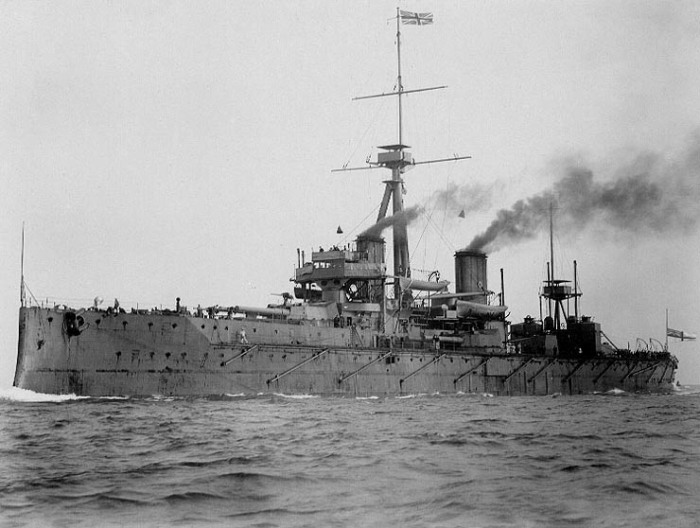

昨天我们说起强者要想达成自己的目标，最好的策略不是战斗，而是威慑。威慑的目的，不只是弱者不敢打，而是把弱者对于力量的想象力控制在强者划定的范围内。是管理弱者的认知和心智。

今天我们继续这个话题，看看，强者如果只是依靠力量，会发生什么？

进化论你肯定很熟悉：“物竞天择，适者生存”。但是你有没有想过，为什么是“适者生存”，而不是“强者生存”？在竞争中，我比别人强，不就有优势么？<escape><!-- more --></escape>

一般人会说，因为环境在变。恐龙很强，但是来了天灾，活不下去。这么说没错。但是假如环境也不变，是不是强者就一定能成为赢家呢？很抱歉，还是不一定。为什么？

我最近看了一本书，叫《动物武器》。作者是位美国人，叫道格拉斯·埃姆伦。他本身是一位昆虫学家，研究进化论。但业余时间，他又是个军事迷，特别喜欢研究各种武器。诶，你看这两个领域，好像没什么关系，但是作者觉得研究的是一个事：你死我活的竞争。

按理说，竞争就是比谁更强大。比如动物世界中，麋鹿的角越大，战斗力就越强，就可以赢得更多的交配权。一代接着一代，角小的麋鹿，它的基因就会逐渐消失。再比如人类争夺海洋。各国都在造强大的军舰，胜利的一方可以拿到更多资源，造出更强大的军舰。长久下去，弱小的一方就越来越没有机会。

但是如果我们把时间拉长，以一千年、一百年作为单位来看，你会发现强者恒强这件事，几乎从没有发生过，尤其是在长时间段里。这是为什么？《动物武器》的作者提出，强者为了变得更强，往往会忽略几件重要的事情。这一忽略，就给了弱者机会了。我们来看看是哪几件事：

首先，为了变得更强，强者付出的成本会远远超出收益。作者用了一种动物作例子：蜣螂。就是滚粪球那个，俗名屎壳郎。

蜣螂是一种住在地穴里的动物。雌性会在地上挖一个洞，然后躲到里面照顾宝宝。雄蜣螂就会守在洞口，防止别人进来抢老婆。它是怎么防守的呢？首先把腿伸到隧道壁里，死死卡住，然后把头朝向外面，用头来和别人打架。

长久下来，这些雄性蜣螂就在脑袋上进化出了大角，而且越来越大。在人类培养箱里，只需要2年、经过7代的繁衍，蜣螂的角就会变得比祖先的大一倍，成为全身最大的器官。这种武器进化的速度简直堪比人类的军备竞赛。

但是蜣螂付出的成本同样惊人。人类培养箱中，大角蜣螂的进食量要比普通蜣螂高出好几倍。在野生条件下，它们普遍营养不良，因为资源都被投入到生长大角上去了。如果把培养箱里的大角蜣螂放到野生环境，它们根本找不到足够多的食物，根本活不下去。

你可能会说，没事，成本可以靠胜利获得的资源来补充，比如更多的交配权、更多的下一代。可关键是，强者一旦进入军备竞赛的逻辑，就会忽略成本和收入的比。它们往往投入得更多，而收获却很小。大角蜣螂可以战胜竞争者，但是体力的衰减使得它的繁殖率反而降低了。这是为什么？

这就引出第二个问题：强者在变强过程中，往往会把自己的发展路径锁死，一条道走到黑，忽略其他解决方案的可能性。
比如按理说，大角蜣螂为了吃到更多的食物，可以让自己更敏捷，提早发现天敌。但是后来因为发育大角耗尽了太多成本，结果就是它们的眼睛要比祖辈小30%，嗅觉会变得更不灵敏，而且行动非常迟缓。动物学家做了一个比喻，大角蜣螂走起路来，就好像人在每条腿上绑20公斤沙袋，非常不灵活。

不仅如此，大角蜣螂的触角、翅膀、还有生殖器都发生了退化。对于这个物种来说，任何基于上面几个器官变异带来的物种改良，都不太可能发生了。它们发展的唯一路径，就是把角再变大，直到环境不能提供更多的资源为止。

但是进化真的只有这一条路么？当然不是。这就是强者变强会忽略的第三件事：当你不断巩固某个优势时，对手不会和你硬拼这条路，而是会寻找其他赛道。

还说蜣螂。如果角大就一定会是胜利者，那野生环境下应该早就没有小角蜣螂了。然而，自然界中大约有四分之一仍然是小角蜣螂。这怎么回事？研究发现，小角蜣螂没有什么特殊的打斗技能，它们根本就不走这条路。

刚才我们说到，大角蜣螂会守在洞穴口，进去的唯一办法在它看来就是打败它。但小角蜣螂可不这么想，它会在旁边再挖一条隧道，挖一条侧面的隧道。挖着挖着，诶，拐到旁边大角蜣螂那个隧道里，然后破壁而入，直扑目标，几分钟之内迅速与雌蜣螂完成交配，再原路返回。

守在洞口那位，因为视力不行、嗅觉不行，完全不知道发生了什么。而且顶着一个大角，在隧道里根本无法转身，很难及时赶走偷袭者。

你乍听起来会觉得，这太无耻了吧。但是如果抛开道德的标准来看，这其实就是一个更好的解决方案。动物世界里，不仅蜣螂会这么干，麋鹿、山羊、鱼、鸟等等，都能找到通过偷情来延续基因的案例。既然靠打架只能当光棍，又打不过强者，那就另辟蹊径，再找一条赛道。

说了这么多，你可能会问：这都是动物的故事，我们是人啊。《动物武器》的作者认为，道理是一样的。我们来看人类最激烈的竞争：战争。

战争中，强者在变强的过程中，同样会忽略我们刚才说的三个问题：成本太高、路径锁死、竞争者另辟蹊径。今年是第一次世界大战结束100周年，我们就拿它举例。

一战中，英国和德国要争夺大西洋的控制权。一开始，他们俩都在发展当时的主流舰艇：战列舰。这是一种拥有大型火炮，在十几公里之外就能击沉对手的战舰，同时还拥有厚重的装甲。但是你想，开支非常大。

英国无畏级战列舰

英国人有钱，资源多，越造越大，越造越强。德国人意识到，自己可能永远赶不上英国人造战列舰的速度，在这条路上走下去，一定打不赢。

于是德国人另辟蹊径，偷偷把经费投入到另一种武器上，这就是潜艇。你可以把潜艇看成当时一种最不要脸的武器，就像偷偷摸到人家洞穴里的小角蜣螂，它可以神不知鬼不觉地击沉别人的船只。

投入使用后，德国潜艇根本不攻击英国的战列舰，而是攻击手无寸铁的英国商船。

英国人就很尴尬，本来造战舰就是为了保护海上运输，但是他们发现自己走得太远，以至于德国人放弃在这条路上和他竞赛了。战列舰只能用来同类相残，打同样大的舰只，但是面对潜艇，它根本无法有效保护商船，成本收入比严重失衡。

当英国人开始寻找对策时才发现，由于他们一直都把所有资源投入到战列舰的建造中，自己在潜艇方面的积累非常薄弱。
在海战最激烈的1917年，英国平均每个月被击沉150艘商船。英国海军上将当时就说，如果再想不出反潜艇的办法，英国就将崩溃。还好，后来美国人加入了战争，重新调整了天平，使得英国最后获得了胜利，此为后话。

如果你翻开人类的战争史，这样的案例比比皆是，甚至会周期性地出现。

总结一下，为什么强者不能恒强？未必和环境变化有关系。其实在强者变强的过程中，就已经种下了灾难的种子。答案有三个：

第一，他们的成本会越来越高；

第二，他们的路径会越来越僵化；

第三，他们的应变能力会越来越差。

今天我们说了强者的软肋，弱者的机会也就在其中了。